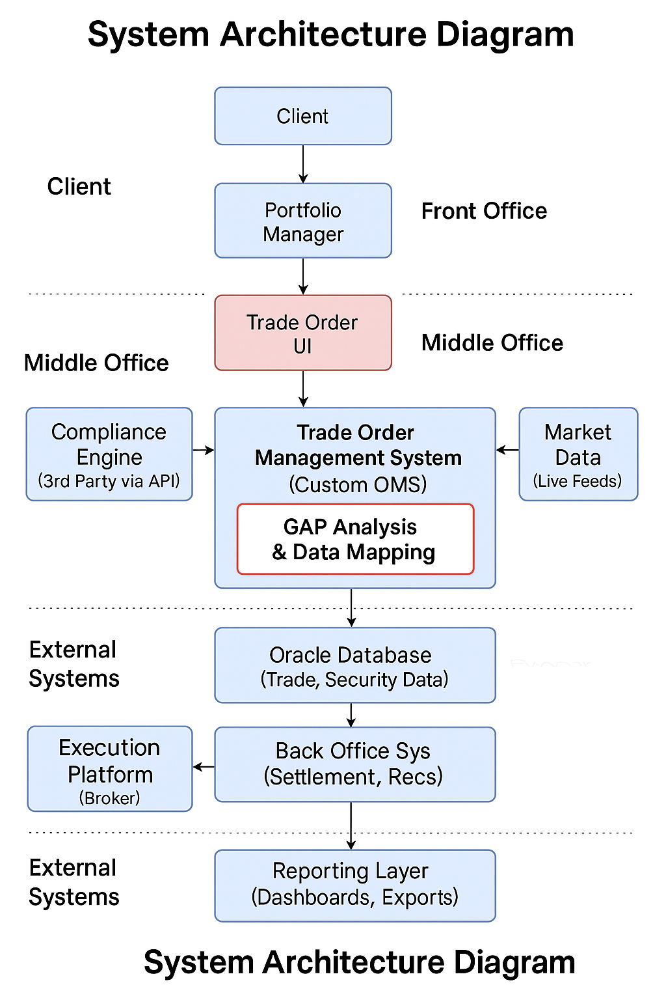
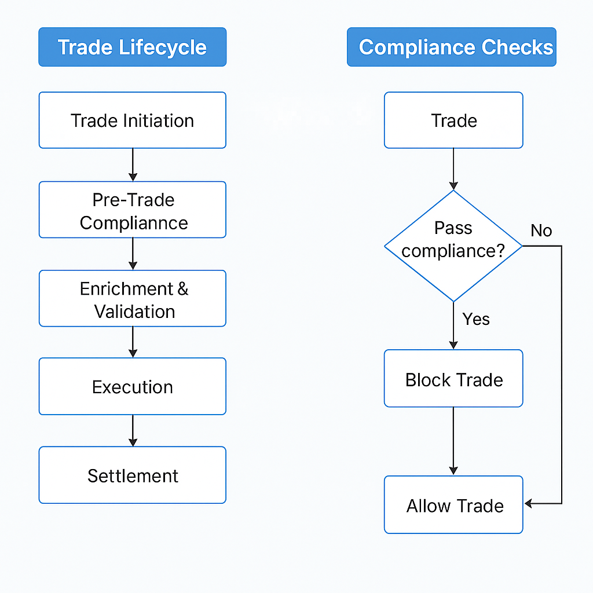

# 🏦 Trade Order Management System Enhancement – Fixed Income, Equities & Derivatives

**📅 Duration:** Oct 2024 – Present  
**🏢 Organization:** STP Investment Services, California  
**👤 Role:** Senior Business Analyst  

---

## 🚀 Project Summary

This project involved enhancing an internal **Trade Order Management System (TOMS)** to support **Straight-Through Processing (STP)** across **Fixed Income**, **Derivatives (Options & Futures)**, and **Equities**.  
The main goal was to automate trade workflows, reduce manual intervention, ensure compliance, and modernize the overall trade lifecycle infrastructure.

Inspired by **Bloomberg TOMS**, the solution included real-time compliance checks, enriched trade data, integration with market data sources, and a scalable architecture.

---

## 🎯 Key Objectives

- Automate trade lifecycle (initiation → settlement)
- Enable pre- and post-trade compliance validation
- Integrate with Bloomberg and external APIs
- Ensure accurate data mapping and transformation
- Deliver audit-ready reports and dashboards

---

## 👨‍💼 Role & Responsibilities – Sr. Business Analyst

As the only Business Analyst on the team, I acted as the **bridge between business and technical stakeholders**, ensuring the solution met user and regulatory expectations.

### Key Contributions:

- Conducted requirement workshops with Traders, Portfolio Managers, and SMEs  
- Performed **GAP analysis** of the legacy vs. target system  
- Created detailed **BRDs, FRDs**, and **workflow diagrams** (Visio)  
- Performed **data mapping** (ISIN, CUSIP, maturity, coupon, etc.)  
- Wrote SQL queries to validate data across systems  
- Integrated **Bloomberg APIs** for real-time market data  
- Designed and validated **compliance rule checks** (pre/post-trade)  
- Participated in **Agile ceremonies** and managed backlog grooming  
- Reviewed QA test cases and managed UAT sessions  
- Created and maintained **RTM** for full traceability  

---

## 🧱 System Architecture

### 🧑‍💼 Front Office
- Traders place orders using the internal **Trade Order UI**
- Integration with **Bloomberg** for real-time market data

### 🛡 Middle Office
- **Compliance Engine** validates orders pre-execution
- Risk and exposure checks
- Trade enrichment and validation

### 🏦 Back Office
- Booking and reconciliation (T+1 / T+2 settlement)
- Trade reporting and audit dashboards

---

## ⚙️ Tech Stack & Tools

| Component               | Tools/Technologies                        |
|------------------------|--------------------------------------------|
| Database               | Oracle DB                                 |
| Diagramming            | MS Visio                                  |
| Reporting              | Excel, Dashboards                         |
| Testing & Mgmt         | JIRA, Confluence                          |
| Market Data Feed       | Bloomberg API                             |
| Compliance Integration | REST-based 3rd-party API                  |
| Querying               | SQL                                       |
| Methodology            | Hybrid            |

---

## 🔁 Trade Lifecycle (Simplified Flow)

1. **Trade Initiation** – Order created via UI  
2. **Pre-Trade Compliance** – Rule validation via compliance engine  
3. **Enrichment** – Instrument data enhanced using Bloomberg  
4. **Execution** – Routed to broker via FIX protocol  
5. **Settlement** – Reconciliation and booking (T+1/T+2)  
6. **Reporting** – Dashboard visualization and audit log exports  

---

## ✅ Sample User Story

**Title:** Validate Trade Against Compliance Rules  
**As a** Portfolio Manager  
**I want** the system to perform real-time compliance checks  
**So that** invalid or risky trades are flagged or blocked

**Acceptance Criteria:**
- ❌ Trades involving restricted securities are blocked  
- 🚩 Orders breaching sector/asset limits are flagged  
- ✅ Compliance outcome is displayed before execution  

---

## 📊 Outcome & Business Value

| Benefit                          | Result                                         |
|----------------------------------|------------------------------------------------|
| ✅ Faster Trade Execution        | Enabled STP and reduced latency                |
| 📉 Reduced Manual Errors         | With validation rules and auto-enrichment     |
| ⚖️ Improved Compliance           | With pre/post trade checks                     |
| 📈 Enhanced Transparency         | Real-time dashboards and audit traceability   |
| 🤝 Cross-Team Collaboration     | Strengthened via Agile processes              |

---

## 👥 Team Structure

- 👤 1 Sr. Business Analyst *(Myself)*  
- 👨‍💻 2 Backend/API Developers    
- 🧪 2 QA Engineers
- 🧠 1 Product Owner 
- 🧭 1 Scrum Master  

**Reporting to:** Product Owner

---

## 📎 Artifacts & Diagrams

### 🗂 System Architecture Diagram  

### 🔄 Workflow Diagrams  
**Trade Lifecycle & Compliance Checks**  
 

---

📄 *Additional Documents (Available upon request):*  
- Functional Requirements Document (FRD)  
- Data Mapping Sheets  
- Requirements Traceability Matrix (RTM)

---

## 📝 Final Note

This project demonstrates my experience in modernizing critical financial systems, improving compliance, and delivering real business value in a fast-paced, regulated environment.

---

## 🌐 Let's Connect

Always open to connecting! Whether it's discussing trends, exploring collaborations, or just saying hello — feel free to reach out! 😊

- 🌱  Currently enhancing my engineering skills  
- 🌍  Based in Pennsylvania, United States   
- ✉️  Email me at [bhargavptl77@gmail.com](mailto:bhargavptl77@gmail.com)  
- 📫  Connect with me on [LinkedIn](https://www.linkedin.com/in/bhargavpatel07/)    
- 🤝  Open to collaborating on exciting projects as a **Business Systems Analyst**
